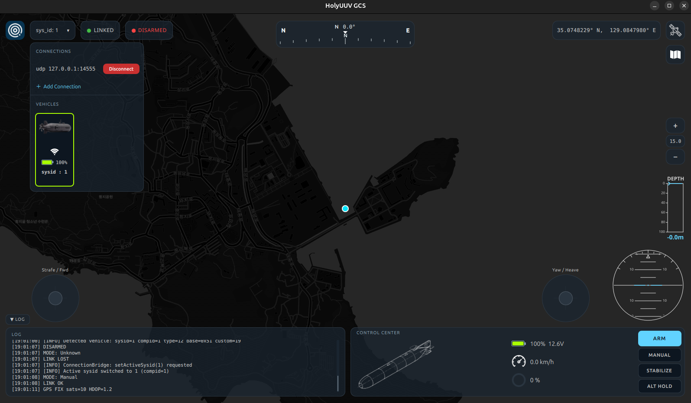

# HolyUUV_GCS v1.0.0



**HolyUUV GCS** is a ground control station purpose-built for autonomous underwater vehicles (AUVs).
Designed from the ground up with underwater robotics in mind, it provides real-time telemetry monitoring,
vehicle control, and 3D terrain visualization — all in a clean, dark-themed interface.

This project is actively maintained and will continue to evolve with new features, improved stability,
and broader hardware support in future releases.

---

## Tech Stack

- **Qt 5** — UI framework (QML, Qt Location, Qt3D)
- **MAVLink** — vehicle communication protocol (ArduSub / ArduPilot compatible)

---

## Platform Support

> ⚠️ **Officially supported on Ubuntu Linux 24.04 (LTS) only.**

The project is developed and tested exclusively on **Ubuntu 24.04**. Other distributions or
Ubuntu versions are **not** guaranteed to work, mainly due to differing Qt 5 / glibc versions.

**On a different OS or Ubuntu version? → Use Docker (recommended).**
Spin up a clean Ubuntu 24.04 container and build inside it:

```bash
docker run -it --rm \
    --gpus all \                              # pass the GPU through (for 3D terrain)
    -e DISPLAY=$DISPLAY \
    -v /tmp/.X11-unix:/tmp/.X11-unix:rw \
    -v "$(pwd)":/workspace \
    ubuntu:24.04 bash

# then, inside the container:
cd /workspace && ./scripts/install_deps.sh && ./scripts/build_project_linux.sh
```

> Don't forget `xhost +local:docker` on the host first so the container can open windows.

---

## Building from Source

Everything is driven by the helper scripts in the [`scripts/`](scripts/) folder.
Run them **in order** from the project root:

```bash
# 1. Install all dependencies (Qt 5 packages + MAVLink headers).
#    This also pulls the MAVLink headers automatically.
./scripts/install_deps.sh

# 2. Clean-build the project (CMake + make).
./scripts/build_project_linux.sh

# 3. Run it.
./build/HolyUUV_GCS
```

| Script | What it does |
|--------|--------------|
| `scripts/install_deps.sh`        | Installs all Qt 5 / build dependencies via `apt`, then runs `setup_mavlink.sh` |
| `scripts/setup_mavlink.sh`       | Downloads the MAVLink C headers (`c_library_v2`) into `3rdparty/` |
| `scripts/build_project_linux.sh` | Clean CMake build → produces `build/HolyUUV_GCS` |
| `scripts/package_appimage.sh`    | *(optional)* Bundles a portable **AppImage** for distribution |

> The scripts can be run from anywhere — each one `cd`s to the project root automatically.

### Want a portable binary?

```bash
./scripts/package_appimage.sh   # → HolyUUV_GCS.AppImage
```

The resulting AppImage runs on **Ubuntu 24.04+** with no installation required:

```bash
chmod +x HolyUUV_GCS.AppImage
./HolyUUV_GCS.AppImage
```

It uses your system GPU when available and falls back to software rendering automatically.

---

## Development

HolyUUV GCS was developed and validated using **Gazebo** simulation via **[Project DAVE](https://github.com/Field-Robotics-Lab/dave)**,
a high-fidelity underwater robotics simulation environment.

---

## Current Limitations

> This project is under active development. The following features are planned for upcoming releases.

| Feature | Status |
|---|---|
| Simulator connection (Gazebo / SITL) | ✅ Supported |
| Real hardware connection | 🔜 Planned |
| Multi-vehicle support | 🔜 Planned |
| Single-vehicle control | ✅ Supported |

Real hardware integration and multi-vehicle support are on the roadmap and will be introduced in future updates.

---

## License

This project is licensed under the **MIT License** — see [LICENSE](LICENSE) for details.

This software uses **Qt 5**, which is licensed under the **GNU LGPL v3**.
Qt is dynamically linked, and its source is available at [qt.io](https://www.qt.io/).
**MAVLink** (c_library_v2) is licensed under the MIT License.
